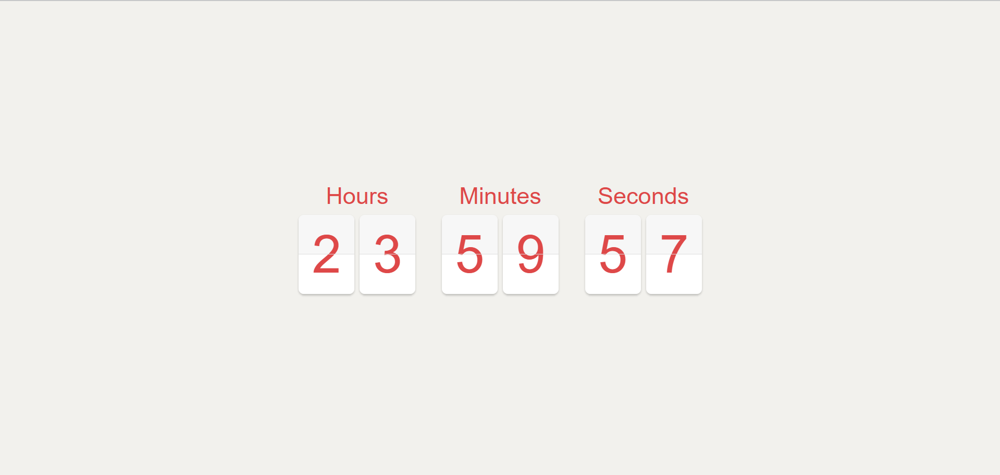

# 🔄 Flip Countdown Timer

A modern, minimalistic countdown timer with a flip animation effect built using HTML, CSS, and JavaScript. This timer visually flips each digit as time counts down, making it ideal for launch pages, promotions, or event reminders.

## 🔗 Live Demo
👉 [View Live Site](https://yashgupta7373.github.io/Flip-Countdown-Timer/)

## 📂 GitHub Repository
👉 [GitHub Repo](https://github.com/yashgupta7373/Flip-Countdown-Timer)

## 🛠️ Tech Stack
- HTML5
- CSS3 (Flip Animation)
- JavaScript

## 📸 Screenshot


## ✨ Features
- Flip-style countdown animation for hours, minutes, and seconds
- Sleek and centered minimalist UI
- Smooth digit transitions and real-time updates
- Responsive layout (desktop & tablet friendly)

## 💡 Use Cases
- Product launch countdown
- Event or birthday timer
- Coming soon pages
- Clean UI practice with CSS animations

## 🚀 How to Use
1. Clone the repository:
   ```bash
   git clone https://github.com/yashgupta7373/Flip-Countdown-Timer.git
2. Open index.html in your browser.

📌 Note
This is a front-end project with a static countdown. You can manually adjust the end time in the JavaScript file.

Made with ❤️ by Yash Gupta